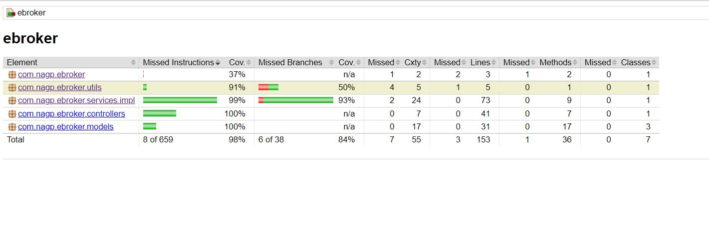

## Code Coverage ##

## 
URL- localhost:8034

#### Different Endpoints #####
1. To add customer aka trader

    Post - http://localhost:8034/customer

        {
            "name": "Nimit",
            "walletAmount": 400.0
        }

2. To get funds

    Get - http://localhost:8034/funds

3. To add funds

    Patch - http://localhost/{customerId}/{fundAmount}

    example - http://localhost/1/120.0

4. To add equity

    Post - http://localhost:8034/equity

        {
            "name": "Can",
            "nav": 100.0
        }

5. To buy equity

    Post - http://localhost:8034/buy/{customerId}/{equityId}/{numberofunits}

    example - http://localhost:8034/buy/1/102/3

6. To sell equity

    Post - http://localhost:8034/sell/{customerId}/{equityId}/{numberofunits}

    example - http://localhost:8034/sell/1/102/3

